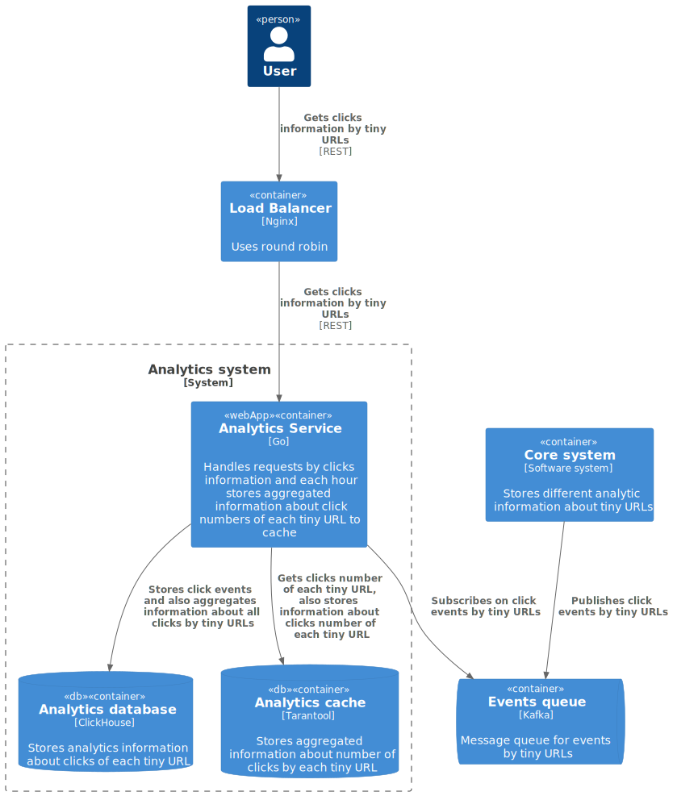

# Tiny URL - System Design

Example of the homework for [course by System Design](https://balun.courses/courses/system_design). 
TinyURL is a URL shortening web service, which provides short aliases for redirection 
of long URLs.

### Functional requirements:

- creates tiny URL from long URL
- redirects from long URL to tiny URL
- gets analytics about tiny URL clicks

### Non-functional requirements:

- 50 000 000 DAU
- availability 99,95%
- tiny URLs are always stored
- service operation time 5 years
- each user creates one tiny URL per week
- on average, each tiny URL is accessed 20 times a day
- geo distribution is not needed
- no seasonality

## Design overview

For system design I have  used [C4 model](https://c4model.com/). The C4 model was created as a way 
to help software development teams describe and communicate software 
architecture, both during up-front design sessions and when retrospectively 
documenting an existing codebase. It's a way to create maps of your code, 
at various levels of detail, in the same way you would use something like 
Google Maps to zoom in and out of an area you are interested in.

     <b>Level 1.</b> System context diagram  

  

     <b>Level 2.</b> Core system container diagram  

 

  

     <b>Level 2.</b> Analytics system container diagram  

 

  

## Basic calculations

RPS (create tiny URL):

    DAU = 50 000 000
    Each user creates one link per week
    RPS = 50 000 000 / 86 400 / 7 ~= 82 

RPS (redirect from long URL to tiny URL):

    DAU = 50 000 000
    Service operation time = 5 years
    Each user creates one link per week
    Created links for 5 years = 50 000 000 / 7 * 365 ~= 3e9
    On average, each tiny URL is accessed 20 times a day
    Maximum RPS = 3e9 * 20 / 86400 ~= 700 000

Tiny URL length:

    Created links for 5 years = 50 000 000 / 7 * 365 ~= 3e9
    URL encoded base64 with length 5, will give ~= 916e6
    URL encoded base64 with length 6, will give ~= 56e9
    Tiny URL length = 6

Required memory:

    Replication factor = 3
    Service operation time = 5 years
    Created links for 5 years = 50 000 000 / 7 * 365 ~= 3e9
    Each record size for link ~= 150B
    Required memory for 5 years = 3e9 * 150 * 3 ~= 1.5TB